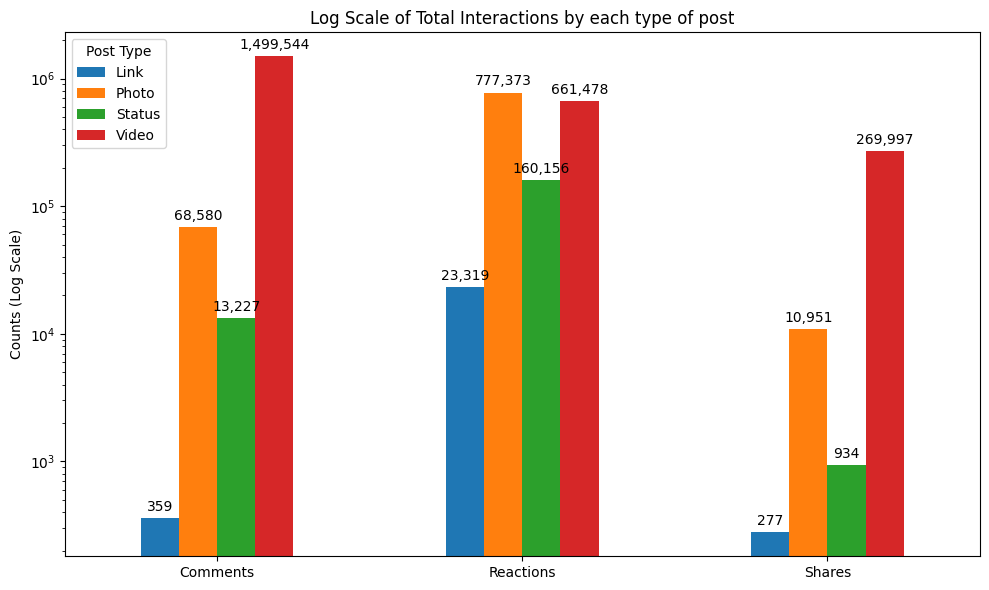
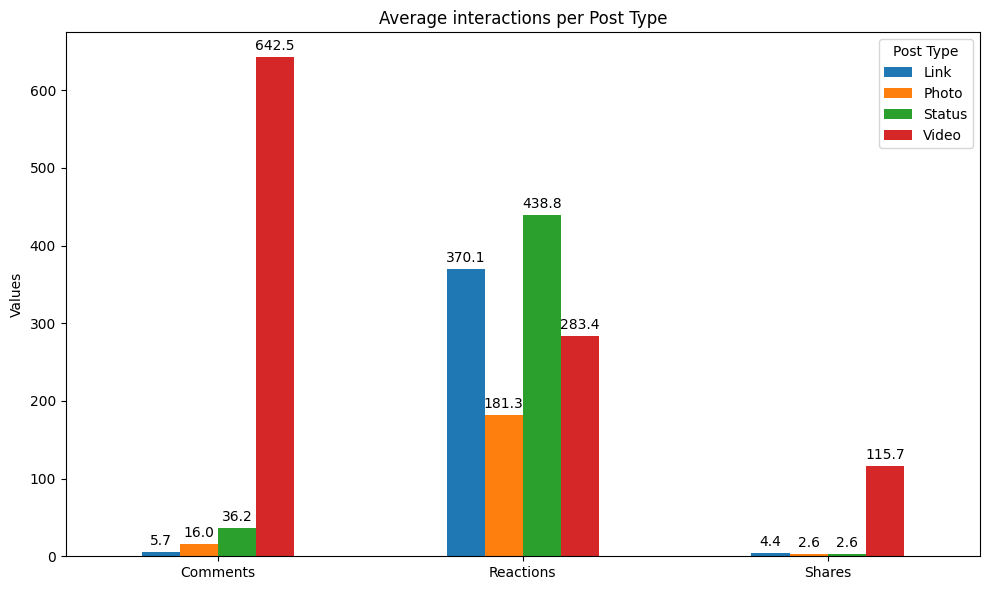
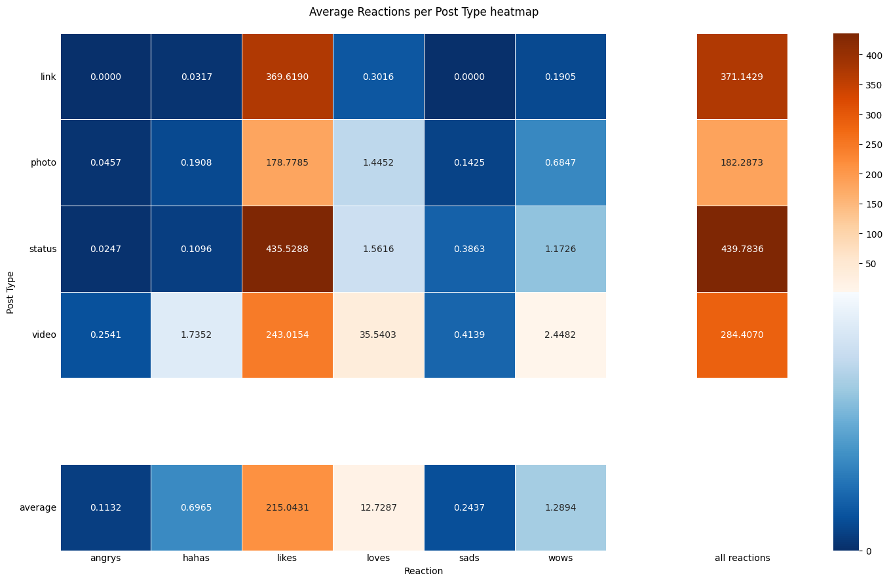
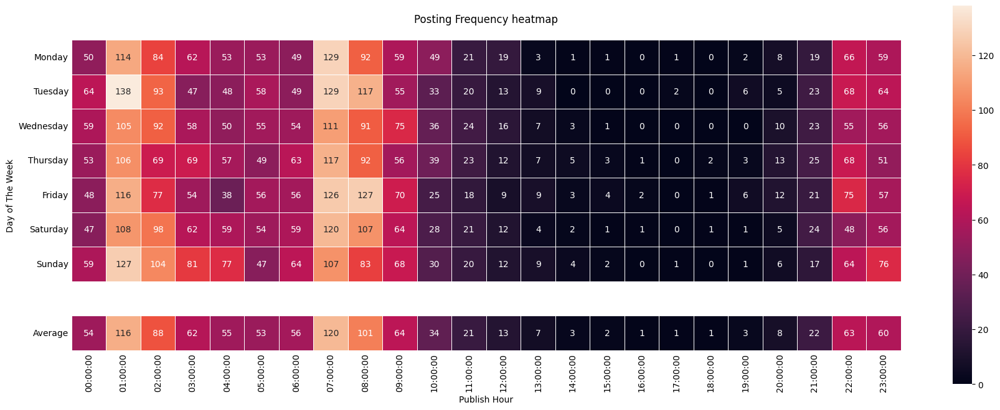
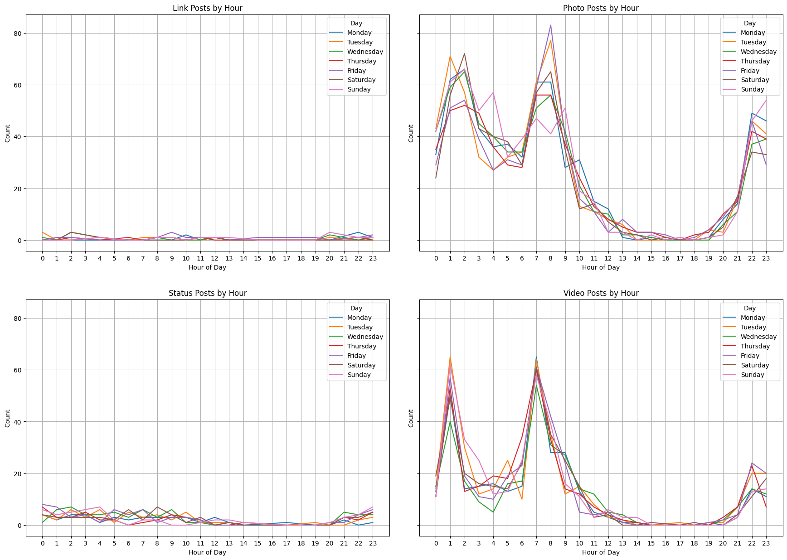
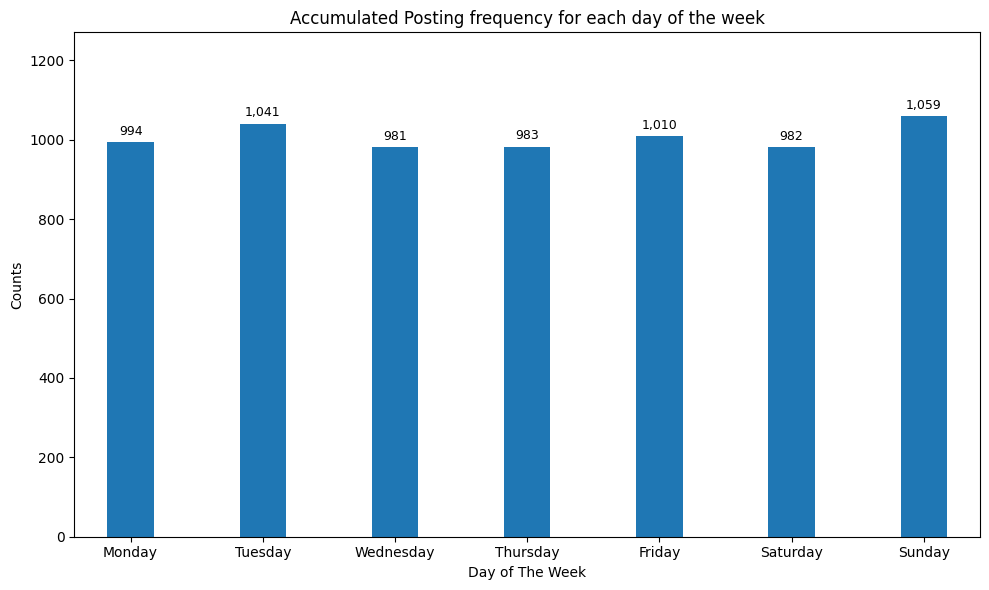

# **Analysing Engagement for retailer pages on Facebook**

## Introduction

Facebook has evolved from a simple social networking platform into a critical business infrastructure that fundamentally shapes modern commerce. Establishing a dedicated Facebook business page now represents an essential strategic investment, providing companies with a comprehensive ecosystem to engage prospective customers, showcase products, and execute direct sales through integrated social commerce features.

The platform's true competitive advantage lies in its capacity for bidirectional communication. Unlike traditional marketing channels that rely on broadcast messaging, Facebook facilitates dynamic, real-time interactions between businesses and their audiences. This interactive environment cultivates authentic relationships and emotional connections that directly influence customer loyalty and purchasing behavior.

This project examines the complexities of Facebook engagement through comprehensive analysis of real-world business data, with the objective of identifying actionable patterns that drive social media marketing success. Our systematic evaluation encompasses post characteristics, interaction metrics, and engagement dynamics to deliver insights that enhance business performance on the platform. The analysis integrates quantitative metrics—including likes, shares, and comments—with qualitative factors such as content type, posting timing, and messaging strategies.

The research serves dual purposes: advancing analytical understanding while providing practical business intelligence applications. By analyzing authentic Facebook business data, this study offers valuable experience in digital marketing analysis, social media strategy development, and data-driven decision-making processes. The findings contribute to both academic knowledge of social media dynamics and practical guidance for businesses optimizing their Facebook presence to achieve measurable commercial outcomes in today's digital marketplace.

## Data

The [dataset](https://archive.ics.uci.edu/dataset/488/facebook+live+sellers+in+thailand) is from UC Irvine Machine Learning Repository. It contains 7,050 Facebook posts of various types (texts, videos, images, and links) from 10 Thai fashion and cosmetics retail sellers during March 2012, to June 2018. The data was obtained through Facebook's API and made anonymous to meet Facebook's developer platform guidelines.

## Metrics

**1. Engagement Metrics**

<table>
  <tr>
    <td style="text-align: center;">
        
        
Total Interactions by Post Type (Displayed in Log-scale)

    </td>
    <td style="text-align: center;">
        
        
Average interactions by Post Type

    </td>
  </tr>
</table>

-   **Total Interactions by Post Type**: Video content emerged as the clear engagement leader, generating the highest overall interaction volumes across the platform. Comment activity concentrated predominantly on video posts, while photos attracted the greatest number of reactions. Users demonstrated a strong preference for sharing video content over all other post formats, with sharing activity almost exclusively focused on this content type. Conversely, link posts consistently underperformed, generating the lowest interaction levels across all metrics.

- **Average Interactions per Post**: Video content maintained its dominance in generating average comments per post, reinforcing its effectiveness for fostering discussion and user engagement. However, status updates achieved the highest average reaction rates, while photos received the fewest reactions per post. Link posts continued to underperform significantly in average comment generation. Sharing behavior remained consistent with overall trends, with users demonstrating a clear preference for redistributing video content.

  

- **Average reactions** *(Likes, Loves, Wows, Hahas, Sads, Angry)*

    -   The emotional response patterns reveal distinct user behavior across content types. Link posts generated exclusively positive sentiment, showing no negative emotional reactions whatsoever. In contrast, video content attracted the highest volume of negative responses, consistently displaying above-average levels of both angry and sad reactions compared to other content formats.
    -   Positive engagement patterns showed likes dominating across all post types, representing the most frequent user response regardless of content format. Status updates and links demonstrated particularly strong like engagement rates. Among negative reactions, sad responses emerged as the most common across the platform, suggesting users are more likely to express empathy than anger when responding negatively to content.

**2. Time-Based Metrics**

  
  

-   **Patterns for posting**: 
    -   **Daily Posting Pattern**: Seller activity exhibited pronounced temporal clustering with two distinct peak periods: late night (1-2 AM) and early morning (7-9 AM). During these windows, nearly all sellers maintained active posting schedules. Activity levels dropped dramatically during afternoon hours, with fewer than 10 posts recorded across the entire seller base.
    -   Content type significantly influenced these temporal patterns. Photo and video posts closely mirrored overall activity trends, concentrating heavily within the late-night and early-morning peak windows. Link and status posts demonstrated markedly different behavior, maintaining relatively consistent posting frequency throughout the day with minimal temporal variation.

  

    
  

  
  -   **Weekly Activity Pattern**: Analysis of day-of-week posting behavior revealed no statistically significant variations across the seven-day cycle. This consistency suggests that seller activity responds primarily to daily routine patterns rather than traditional weekly business cycles or consumer shopping patterns.

## Summary of Insights

1. **Video Content Dominates User Engagement**: Videos consistently outperform all other content types, generating the highest levels of interactions, comments, and shares. This finding indicates that Thai fashion and cosmetics retailers should prioritize video content as their primary engagement strategy to maximize audience reach and interaction.
2. **Strategic Content Differentiation**: Each post format fulfills specific engagement objectives: videos excel across nearly all engagement metrics, status updates generate the strongest positive emotional responses, and photos provide broad appeal with moderate interaction levels. Link posts significantly underperform across all measures, suggesting minimal strategic value for these retailers.
3. **Untapped Timing Opportunities in Content Distribution**: The concentrated posting activity during late-night and early-morning hours, coupled with minimal afternoon engagement, reveals a strategic gap. This pattern suggests either strong audience availability during off-peak hours or missed opportunities to reach customers during less competitive afternoon time slots.
4. **Daily Routine-Driven Patterns**: The consistent daily posting patterns without weekly variations indicate that seller activity aligns with daily routines and immediate audience availability rather than traditional business cycles. This behavior pattern aligns logically with the lifestyle nature of fashion and cosmetics products, where purchase decisions often occur spontaneously rather than following planned shopping cycles.

## Conclusions and Recommendations

This comprehensive analysis demonstrates that video content functions as the primary driver of audience engagement, delivering superior performance across all measured metrics. These findings indicate that sellers should prioritize video production and curation strategies to maximize their platform potential and audience reach.

Temporal posting patterns reveal significant strategic implications for content distribution. The concentration of seller activity during late-night and early-morning hours indicates strong audience availability during these periods. Retailers should consider two strategic approaches: intensifying posting frequency during established peak engagement windows or exploring content distribution during off-peak afternoon periods to capture underserved audience segments.

The analysis reveals that merchants in this sector should maintain consistent daily presence rather than organizing campaigns around seasonal or weekly business cycles. This recommendation aligns with the spontaneous, lifestyle-oriented purchasing behavior characteristic of fashion and cosmetics consumers, who make decisions based on immediate inspiration rather than planned shopping patterns.

For Thai fashion and cosmetics retailers, these insights translate into actionable strategic frameworks: prioritizing video content development, implementing daily posting schedules optimized around peak engagement periods, and maintaining consistent platform presence. By adopting these data-driven approaches, retailers can enhance their digital marketing effectiveness and establish stronger connections with their target customer base.
